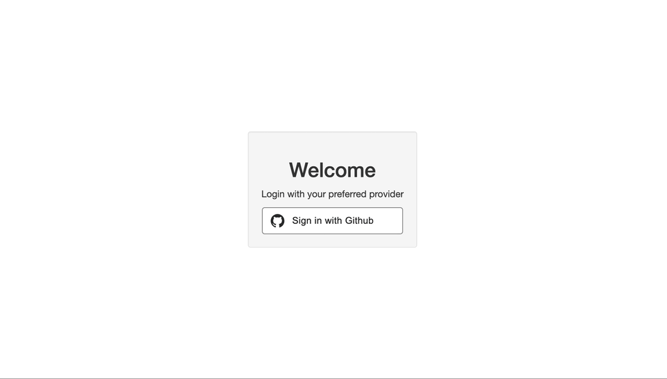
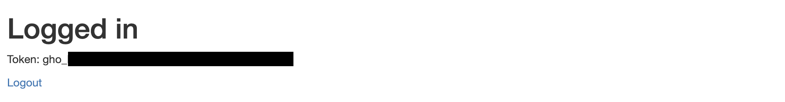
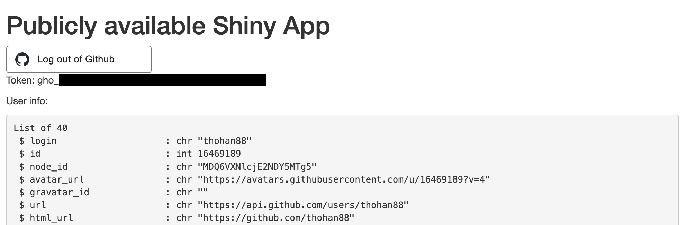
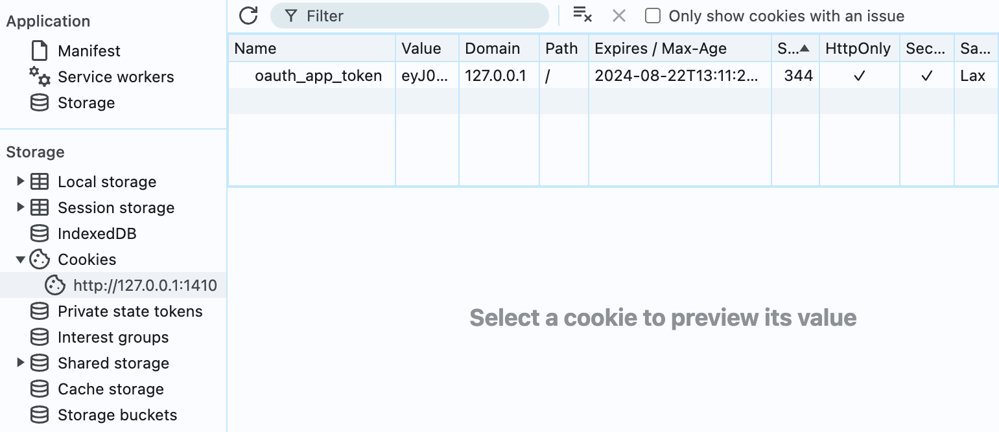
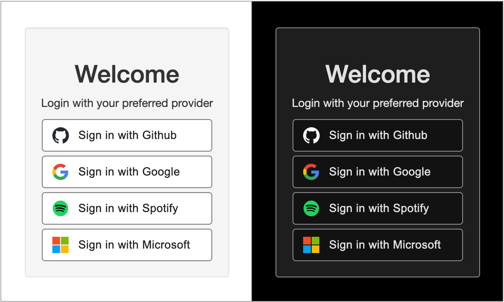

```{r, include = FALSE}
knitr::opts_chunk$set(
  collapse = TRUE,
  comment = "#>"
)
```

```{r setup}
library(httr2) 
```

This vignette demonstrates how to integrate OAuth 2.0 authorization into your
Shiny applications using the httr2 package. The `oauth_shiny_app()` function 
streamlines the OAuth workflow, handling the authentication process behind the scenes.

By the end of this vignette, you should understand how to:

- Enforce user login before accessing your Shiny app.

- Retrieve OAuth tokens on behalf of users to interact with external APIs.

- Set up custom and standard OAuth Shiny clients (e.g., GitHub, Google, Spotify).

- Customize the user login and logout experience.

- Deploy an OAuth-enabled Shiny app to the cloud.

## Getting started

### Prerequisites

Before diving in, you need to register an OAuth client. For quick setup, we
recommend using GitHub from your
[Developer Settings](https://github.com/settings/developers), 
though other providers can also be used.

Set your OAuth credentials as environment variables:

```{r preqrequisites_client, eval=FALSE}
Sys.setenv(OAUTH_GITHUB_CLIENT_ID = "GithubClientID")
Sys.setenv(OAUTH_GITHUB_CLIENT_SECRET = "GithubClientSecret")
```

Next, configure your Shiny app's port and set up a secure passphrase for signing
and encrypting cookies. The callback URL should be set to 127.0.0.1:{port}
(not localhost). Ensure the port matches your Shiny application’s port.

```{r preqrequisites_other}
options(shiny.port = 1410)
options(shiny.launch.browser = TRUE)
Sys.setenv(HTTR2_OAUTH_PASSPHRASE = "MySecurePassPhraseHere")
Sys.setenv(HTTR2_OAUTH_REDIRECT_URL = "http://127.0.0.1:1410")
```

### Setting up OAuth clients

To set up an OAuth Shiny client, use the family of `oauth_shiny_client_*()`
functions provided by `httr2`. The package includes pre-configured clients for
popular providers like GitHub, Google, Microsoft, and Spotify.

Here’s an example of setting up a GitHub OAuth client:

```{r shiny_client_github}
oauth_shiny_client_github()
```
You can easily configure multiple clients using `oauth_shiny_client_config()`, 
which accepts a list of clients:

```{r shiny_client_config}
oauth_shiny_client_config(
  oauth_shiny_client_github(),
  oauth_shiny_client_spotify()
)
```

### Testing your OAuth configuration

The httr2 package includes an example app you can run to test your
config:

```{r myfirstoauthapp, eval=FALSE}
config <- oauth_shiny_client_config(
  oauth_shiny_client_github(
    auth_provider = TRUE,    # Shiny client should be used to restrict app access
    access_token_validity = 600 # Expiry time of access token cookie
  )
)

oauth_shiny_app_example(config)
```

This example app provides a login UI for GitHub. Upon successful login, you
should see an access token displayed, which expires in ten minutes. The app 
also shows your name in the top right corner, with a logout timer set to 60
minutes by default. You can customize this with the token_validity parameter.
`token_validity` parameter.



### Creating a Shiny OAuth Application

Once your configuration works as expected, you can create your own Shiny app
with OAuth integration. This is as simple as passing your Shiny app object into
`oauth_shiny_app()`.

Let’s create an example app that prints the OAuth token retrieved from GitHub:

```{r message = FALSE, eval = FALSE}
library(shiny)

config <- oauth_shiny_client_config(
  oauth_shiny_client_github(
    auth_provider = TRUE,
    access_token_validity = 3600
  )
)

ui <- fluidPage(
  h1("Logged in"),
  verbatimTextOutput("token", TRUE),
  a(href = "logout", "Logout")
)

server <- function(input, output, session) {
  output$token <- renderText({
    token <- oauth_shiny_get_access_token(config$github)
    token[["access_token"]]
  })
}

shinyApp(ui, server) |>
  oauth_shiny_app(config)
```



If you haven't logged out of the example app, you shouldn't need to log in
again. httr2 caches tokens as secure HttpOnly cookies. If you did log out,
GitHub will silently redirect you back to the app without requiring reauthorization.

### Disabling authentication

You can create a public Shiny app while still allowing users to log in and
retrieve user information from GitHub. To disable mandatory authentication, 
set `require_auth = FALSE`.

Here’s a simple example:

```{r, message = FALSE, eval = FALSE}
library(shiny)

config <- oauth_shiny_client_config(
  oauth_shiny_client_github(
    auth_provider = TRUE,
    access_token_validity = 3600
  )
)

ui <- fluidPage(
  h1("Publicly available Shiny App"),
  uiOutput("button"),
  p("Token:", textOutput("token", inline = TRUE)),
  p("User info:", verbatimTextOutput("userinfo"))
)

server <- function(input, output, session) {
  token <- reactive(oauth_shiny_get_access_token(config$github))
  logged_in <- reactive(!is.null(token()))
  # Render a login or logout button depending on whether the user is logged in
  output$button <- renderUI({
    path  <- if (logged_in()) "logout/github" else "login/github"
    title <- if (logged_in()) "Log out of Github" else "Log in to Github"
    oauth_shiny_ui_button_github(path, title)
  })
  # Print token
  output$token <- renderText(token()[["access_token"]])
  # Print userinfo from Github
  output$userinfo <- renderPrint({
    req(token())
    request("https://api.github.com/user") |>
      req_auth_bearer_token(token()$access_token) |>
      req_perform() |>
      resp_body_json() |>
      str()
  })
}

shinyApp(ui, server) |>
  oauth_shiny_app(config, require_auth = FALSE)
```



### Limitations and Considerations

#### State Loss During Redirection
Currently, Shiny OAuth apps lose state during the OAuth redirection process.
One potential workaround is to bookmark the application’s state and include it
in a state parameter during the OAuth flow. This approach might be feasible 
for simple apps but could become unwieldy for more complex applications.

#### Local Development

- Use `http://127.0.0.1` instead of `http://localhost` as the redirect URL.
Cookies set at localhost won’t persist when using 127.0.0.1, causing the OAuth
flow to fail.

- If using RStudio, set `options(shiny.launch.browser = TRUE)` to avoid issues
with the built-in browser, which does not support external redirects and OAuth
cookies.

#### Shinyapps.io
Shinyapps.io generally works well for non-OpenID providers (e.g., GitHub and
Spotify). However, OpenID providers like Google and Microsoft may cause issues
due to the way shinyapps.io handles redirection. Specifically, the callback may
trigger a loading screen that replays the OAuth flow. This is an ongoing
issue with no known workaround at the time.

#### Cloud Deployment
Shiny OAuth apps can be deployed as Docker containers, even on serverless
platforms like Azure Container Apps and Google Cloud Run. Ensure you set the
`HTTR2_OAUTH_APP_URL` environment variable to guarantee the correct server URL
is inferred.

#### Shiny Server
Shiny Server is not compatible with Shiny OAuth apps because it
[strips cookies](https://groups.google.com/g/shiny-discuss/c/nHFbL0K38k8/m/FndeYifoAwAJ),
which are essential for maintaining authentication.

## Understanding the OAuth Flow in Shiny with httr2

### Step 0: User visits a Shiny OAuth App
When a user accesses the app, `oauth_shiny_app()` checks for an existing
`oauth_app_token cookie`, which contains a signed JSON Web Token (JWT) with
claims such as `identifier`, `aud`, `sub`, and `email`. If the cookie is valid,
the user is allowed into the app; otherwise, they are redirected to the
login UI.

To retrieve the app token within the server, use:

```{r, eval = FALSE}
# In Shiny
token <- oauth_shiny_get_app_token()
```

You can inspect the cookie from your browser by navigating to
`Dev Tools > Applicaction`.



It is also possible to inspect the claims by copying the cookie value to
your R console:

```{r, eval=FALSE}
cookie_value <- "Your value here"
jose::jwt_split(cookie_value)  
```

By default, `oauth_shiny_app()` has a `token_validity` set to one hour.
This ensures that both the JWT and the cookie (`max-age`) expires at
this time. The user may attempt to adjust the `max-age` of the cookie
manually, but this will fail signature verification when decoding the
JWT.

If the `oauth_app_token` cookie does not exist or signature verification
of the cookie fails, the user is denied entry to the app and redirected
to `login_ui`. If signature verification succeeds, the user is let into
the app.

To retrieve the app token from the server side in a shiny app (e.g. to
populate the user's name), use `oauth_shiny_get_app_token()`:

```{r, eval=FALSE}
# In shiny
token <- oauth_shiny_get_app_token()
```

#### Client access tokens

In addition to the app token (`oauth_app_token`), the user cookies can
also contain client access tokens. These cookies will typically be named
`oauth_app_token_{client}` (e.g. `oauth_app_token_spotify`) or similar.
They contain access tokens which the user has requested when an
`oauth_shiny_client` has `access_token_validity` set to a duration
larger than 0. These tokens are encrypted using `sodium` and can only be
decrypted using the passphrase. To request a decrypted token from the
server side in a shiny application, use
`oauth_shiny_get_access_token()`:

```{r, eval=FALSE}
# In shiny
config <- oauth_shiny_client_config(
  oauth_shiny_client_github(
    access_token_validity = 3600
  )
)
oauth_shiny_get_access_token(config$github)
```

### Step 1: User is prompted with login UI

If `require_auth = TRUE,` users without a valid token are redirected to a login UI
(`login_ui`). The standard UI includes login buttons for each OAuth client.
You can also customize the login screen or disable it entirely.



The login screen can also be disabled:

```{r eval = FALSE}
oauth_shiny_app(config, login_ui = NULL)
```

This will instead route the user directly to the client for
authorization and requires setting one `oauth_shiny_client` as the
primary provider (`auth_provider_primary = TRUE)`. Automatically
redirecting a non-logged in user to the authentication provider may be
preferred in an enterprise context where the application is an internal
tool, but most users prefer to have a better understanding of the sign
in process.

Login buttons contain links to automatically generated endpoints such as
`login/github/` and `login/spotify` based on the value of `login_path`
and `logout_path` of each `oauth_shiny_client()`.

### Step 2: Redirection to OAuth Client

When the user is redirected to the resource server of an
`oauth_shiny_client()`, a cookie with a randomly generated state and
PKCE verifier (if applicable) are set. The client ID is included as part
of the generated state to ensure that callbacks arriving at the same url
can be routed to their respective token endpoints if there are multiple
clients.

### Step 3: Callback from OAuth Client, requesting token

When the user is routed back to the application with an authorization
code, the state cookie is compared to the retrieved state to verify the
request.

The authorization code is then used to request an access token from the
client. If the client is an OpenID provider, the signature of the token
is verified. Claims such as audience, subject, name and e-mail are then
retrieved either from the ID token (OpenID) or by using a custom claim
function, see `oauth_shiny_client_github_set_custom_claim()`. If the
client is an auth provider (`auth_provider = TRUE`), these claims
are then signed and stored in a cookie (`oauth_app_token`) with expiry
set to `token_validity`. This cookie ensures that an authenticated user
returning to the app can bypass login within the expiration period.

By default, the access token of an OAuth Shiny client is not stored.
Setting `access_token_validity` to value larger than 0 will store this
value in an encrypted cookie, and it can be retrieved from the server
side using `oauth_shiny_get_access_token()` as seen in the example
above.

```{r, eval = FALSE}
config <- oauth_shiny_client_config(
  oauth_shiny_client_github(
    auth_provider = TRUE,
    access_token_validity = 3600
  )
)

# In shiny: Retrieve access token 
oauth_shiny_get_access_token(config$github)
```

## Step 4: Logout

When the user clicks logout, the user is redirected to the `logout`
endpoint where all app and client cookies are deleted before being
redirected to a logout page which can be customized with (`logout_ui`).

It is also possible to just log out of a single provider which will
delete the corresponding client cookie, but not touch app cookies.
Redirect the user to `logout/{client}` in this case (e.g.
`logout/github`).

A user could potentially keep the session alive beyond the validity of
the app token. If you want to automatically sign the user out when such
a case happens, use `oauth_shiny_app(..., logout_on_token_expiry = TRUE)`.

## Custom clients

To set up a custom client, use `oauth_shiny_client()` with `name`, `id`
and `secret`. If the OAuth clients does not confirm to the OpenID spec,
you would also need to supply `auth_url` and `token_url`. To test the
application you could either visit `login/{name}`-endpoint or use the
example application:

```{r, eval = FALSE}
options(shiny.port = 1410)
options(shiny.launch.browser = TRUE)

strava <- oauth_shiny_client(
  name = "strava",
  id = Sys.getenv("OAUTH_STRAVA_CLIENT_ID"),
  secret = Sys.getenv("OAUTH_STRAVA_CLIENT_SECRET"),
  auth_url = "https://www.strava.com/oauth/authorize",
  token_url = "https://www.strava.com/api/v3/oauth/token",
  pkce = FALSE,
  scope = "read",
  access_token_validity = 30
)

config <- oauth_shiny_client_config(strava)

oauth_shiny_app_example(config, require_auth = FALSE)
```

### Adding login buttons

If this works fine, we can add a sign-in button to the client. The logo
could either be specified as an inline SVG, a link to a local file or
omitted:

```{r, eval = FALSE}
options(shiny.port = 1410)
options(shiny.launch.browser = TRUE)

svg <- '<svg xmlns="http://www.w3.org/2000/svg" width="16" height="16" fill="white" class="bi bi-strava" viewBox="0 0 16 16">
  <rect width="16" height="16" fill="#FC4C02"/>
    <path d="M6.731 0 2 9.125h2.788L6.73 5.497l1.93 3.628h2.766zm4.694 9.125-1.372 2.756L8.66 9.125H6.547L10.053 16l3.484-6.875z"/>
</svg>'

strava_button <- oauth_shiny_ui_button("login/strava", "Sign in with Strava", svg)
strava_button_dark <- oauth_shiny_ui_button("login/strava", "Sign in with Strava", svg, "dark")

strava <- oauth_shiny_client(
  name = "strava",
  id = Sys.getenv("OAUTH_STRAVA_CLIENT_ID"),
  secret = Sys.getenv("OAUTH_STRAVA_CLIENT_SECRET"),
  auth_url = "https://www.strava.com/oauth/authorize",
  token_url = "https://www.strava.com/api/v3/oauth/token",
  pkce = FALSE,
  scope = "read",
  auth_provider = TRUE,
  login_button = strava_button,
  login_button_dark = strava_button_dark,
  access_token_validity = 30 # For displaying token in example app
)

config <- oauth_shiny_client_config(strava)

oauth_shiny_app_example(config, require_auth = TRUE)
```

### Setting custom claims

You may notice that the app does not contain the name of the user in the
top right corner. This is because the cookie `oauth_app_token` does not
contain any claims with `name`. Let's add this and some additional
claims to the cookie:

```{r, eval = FALSE}
strava_custom_claims <- function(client, token) {
  list(
    sub = as.character(token$athlete$id),
    aud = "strava.com",
    name = paste(token$athlete$firstname, token$athlete$lastname)
  )
}
```

You may now pull everything together to a `oauth_shiny_client_strava()`
if you like, or just use it like below. Remember to log out of the application
and back in for your name to appear:

```{r, eval = FALSE}
options(shiny.port = 1410)
options(shiny.launch.browser = TRUE)

svg <- '<svg xmlns="http://www.w3.org/2000/svg" width="16" height="16" fill="white" class="bi bi-strava" viewBox="0 0 16 16">
  <rect width="16" height="16" fill="#FC4C02"/>
    <path d="M6.731 0 2 9.125h2.788L6.73 5.497l1.93 3.628h2.766zm4.694 9.125-1.372 2.756L8.66 9.125H6.547L10.053 16l3.484-6.875z"/>
</svg>'

strava_button <- oauth_shiny_ui_button("login/strava", "Sign in with Strava", svg)
strava_button_dark <- oauth_shiny_ui_button("login/strava", "Sign in with Strava", svg, "dark")

strava_custom_claims <- function(client, token) {
  list(
    sub = as.character(token$athlete$id),
    aud = "strava.com",
    name = paste(token$athlete$firstname, token$athlete$lastname)
  )
}

strava <- oauth_shiny_client(
  name = "strava",
  id = Sys.getenv("OAUTH_STRAVA_CLIENT_ID"),
  secret = Sys.getenv("OAUTH_STRAVA_CLIENT_SECRET"),
  auth_url = "https://www.strava.com/oauth/authorize",
  token_url = "https://www.strava.com/api/v3/oauth/token",
  pkce = FALSE,
  scope = "read",
  auth_provider = TRUE,
  auth_set_custom_claim = strava_custom_claims,
  login_button = strava_button,
  login_button_dark = strava_button_dark,
  access_token_validity = 30
)

config <- oauth_shiny_client_config(strava)

oauth_shiny_app_example(config, require_auth = TRUE)
```

## Custom OpenID clients

For OpenID clients, all you need is a client ID, secret and a Discovery
Endpoint, often known as a Well-Known Endpoint such as
[https://accounts.google.com/.well-known/openid-configuration]().
Provide the `openid_issuer_url` which is the Discovery Document URL
without the `.well-known...` path:

```{r, eval = FALSE}
google_openid <- oauth_shiny_client(
  name = "google",
  id = "GoogleClientID",
  secret = "GoogleClientSecret",
  openid_issuer = "https://accounts.google.com/"
)
```

See `oauth_shiny_client_google()` for an example which also includes the
necessary scopes and sign in buttons.

Httr2 will request the Discovery Document to populate authorization and
token endpoints, in addition to fetching public keys for verifying the
signature of the retrieved ID token from the endpoint.

### Microsoft setup

Some OpenID providers will not have a common endpoint like the one
above, but requires you to specify the endpoint based on your tenant,
e.g. Microsoft:

```{r, eval = FALSE}
oauth_shiny_client_microsoft(
  openid_issuer_url = "https://login.microsoftonline.com/{TENANT}/v2.0",
)
```

## Deployment

Apps should just work on cloud services like Azure Container Apps and
Cloud Run. Currently, httr2 can struggle with inferring the correct app
url for redirects. This will likely improve in the future, but for now
it is strongly advised to set the `HTTR2_OAUTH_APP_URL` variable to the
url of your application to ensure that this works as expected. Below is
a typical Dockerfile which should work:

### Example application

Located at `app/app.R`:

```{r, eval = FALSE}
library(httr2)

client_config <- oauth_shiny_client_config(
  oauth_shiny_client_github(auth_provider = TRUE, access_token_validity = 30),
  oauth_shiny_client_google(auth_provider = TRUE, access_token_validity = 30),
  oauth_shiny_client_spotify(auth_provider = TRUE, access_token_validity = 30)
)

oauth_shiny_app_example(
  client_config,
  require_auth = TRUE,
  dark_mode = TRUE
)
```

### Dockerfile

```         
FROM rocker/r-ver:4.4.0

COPY ./app ./app

RUN apt-get update && \
    apt-get install -y \
    libcurl4-openssl-dev \
    libsodium-dev

RUN install2.r -e \
    bslib \
    jose \
    openssl \
    remotes \
    shiny \
    sodium

RUN R -e "remotes::install_github('thohan88/httr2', ref = 'oauth-shiny-auth')"

EXPOSE 1410
CMD ["R", "-e", "shiny::runApp('app', host='0.0.0.0', port=1410)"]
```

### Required environment variables

Set these environment variables on the cloud runtime depending on your client config:

```         
HTTR2_OAUTH_PASSPHRASE
HTTR2_OAUTH_APP_URL
HTTR2_OAUTH_REDIRECT_URL
OAUTH_MICROSOFT_CLIENT_ID
OAUTH_MICROSOFT_CLIENT_SECRET
OAUTH_GITHUB_CLIENT_ID
OAUTH_GITHUB_CLIENT_SECRET
OAUTH_GOOGLE_CLIENT_ID
OAUTH_GOOGLE_CLIENT_SECRET
OAUTH_IDPORTEN_CLIENT_ID
OAUTH_SPOTIFY_CLIENT_ID
OAUTH_SPOTIFY_CLIENT_SECRET
```
